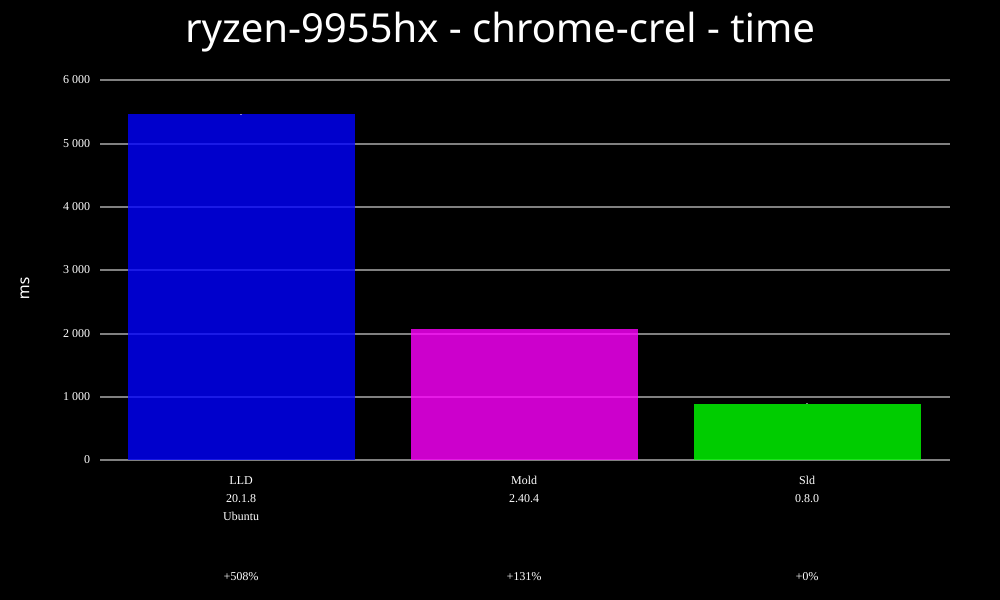
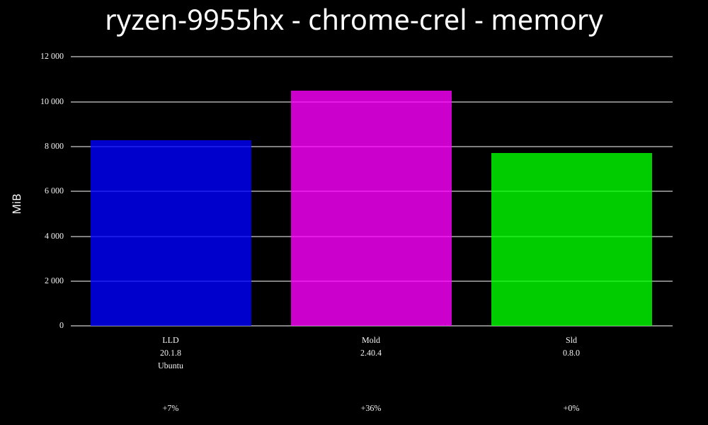
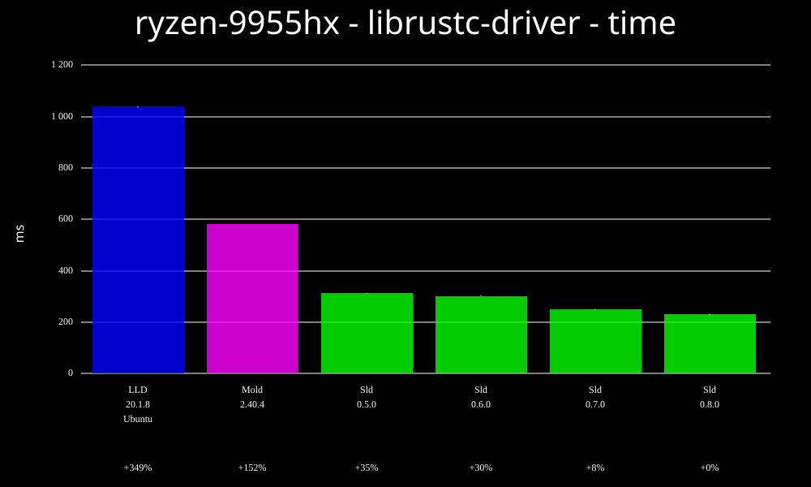
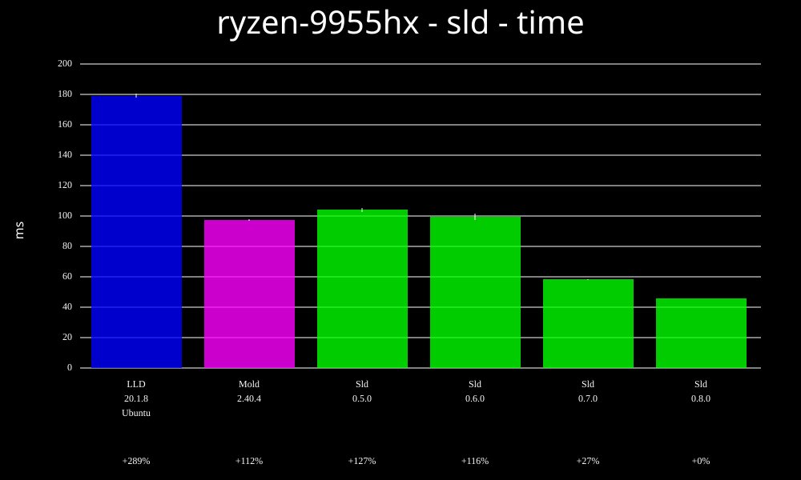
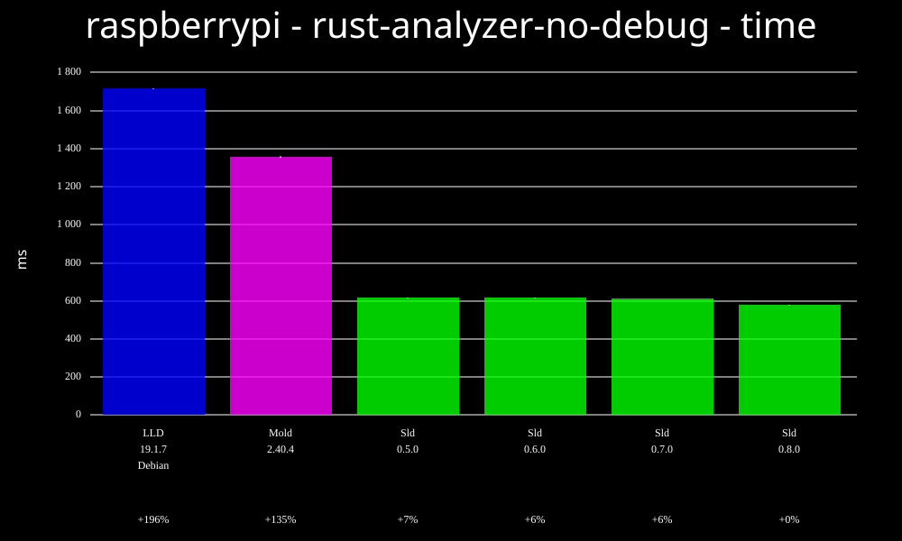

# sld linker

sld is a linker with the goal of being very fast for iterative development.

The plan is to eventually make it fully incremental. Initial incremental support can reuse an
existing output for unchanged relinks, update rewritten inputs whose contents are unchanged, and
patch some same-layout changed object files in place. It still conservatively falls back to a full
relink when arguments change or when an input change is outside the currently patchable subset. sld
is already pretty fast even without fully general fine-grained incremental updates.

## Installation

### From GitHub releases

Download a tarball from this repository's releases page. Unpack it and copy the `sld` binary
somewhere on your path.

### Cargo binstall

If you have [cargo-binstall](https://github.com/cargo-bins/cargo-binstall), you can install sld as
follows:

```sh
cargo binstall sld-linker
```

### Brew

```sh
brew install sld-linker/sld/sld
```

### Build latest release from crates.io

```sh
cargo install --locked sld-linker
```

### Nix

For flake, overlay, and derivation usage, see [the nix documentation](./nix/nix.md).

## Using as your default linker

If you'd like to use sld as your default linker for building Rust code, you can put the following
in `~/.cargo/config.toml`.

On Linux:
```toml
[target.x86_64-unknown-linux-gnu]
linker = "clang"
rustflags = ["-Clink-arg=--ld-path=sld"]
```

Alternatively, you can create symlink `ld.sld` pointing to `sld` and use:
```toml
[target.x86_64-unknown-linux-gnu]
linker = "clang"
rustflags = ["-Clink-arg=-fuse-ld=sld"]
```
The above steps also work for clang when building C/C++ code, just add the following to your LDFLAGS
after adding the `ld.sld` symlink:
```
export LDFLAGS="${LDFLAGS} -fuse-ld=sld"
```

Starting with GCC **16.1**, use `-fuse-ld=sld`.

For older GCC releases, you can make it force use it with the [-Bprefix](https://gcc.gnu.org/onlinedocs/gcc/Directory-Options.html#index-B) option.
Create a symlink `ld` pointing to `sld` and pass the directory containing it to gcc. For example you can do the following:

```sh
ln -s /usr/bin/sld /tmp/ld
```

And when compiling C/C++ code pass the directory containing `ld` to your `CFLAGS`, `CXXFLAGS`, and `LDFLAGS`:

```sh
export CFLAGS="${CFLAGS} -B/tmp"
export CXXFLAGS="${CXXFLAGS} -B/tmp"
export LDFLAGS="${LDFLAGS} -B/tmp"
```

Afterwards you can check if sld was used for linking with [readelf](#how-can-i-verify-that-sld-was-used-to-link-a-binary)

On Illumos:
```
[target.x86_64-unknown-illumos]
# Absolute path to clang - on OmniOS this is likely something like /opt/ooce/bin/clang.
linker = "/usr/bin/clang"

rustflags = [
    # Will silently delegate to GNU ld or Sun ld unless the absolute path to sld is provided.
    "-Clink-arg=-fuse-ld=/absolute/path/to/sld"
]
```

## Q&A

### Why another linker?

Mold is already very fast, however it doesn't do incremental linking and the author has stated that
they don't intend to. sld has initial incremental support, and fine-grained incremental updates are
the end-goal. By writing sld in Rust, it's hoped that the complexity of incremental linking will be
achievable.

### What's working?

The following platforms / architectures are currently supported:

* x86-64 on Linux
* ARM64 on Linux
* RISC-V (riscv64gc) on Linux
* LoongArch64 on Linux (initial support)

The following is working with the caveat that there may be bugs:

* Output to statically linked, non-relocatable binaries
* Output to statically linked, position-independent binaries (static-PIE)
* Output to dynamically linked binaries
* Output to shared objects (.so files)
* Rust proc-macros, when linked with sld work
* Most of the top downloaded crates on crates.io have been tested with sld and pass their tests
* Debug info
* GNU jobserver support
* Partial linker script support. See the [linker script support matrix](LINKER_SCRIPT_SUPPORT.md) for details.

### What isn't yet supported?

Here are some of the larger things that aren't yet done, roughly sorted by current priority:

* Fully general fine-grained incremental updates for changed inputs
* More complex linker scripts
* Mach-O support
* Windows support
* Linker plugin LTO (initial support is behind `--features=plugins`).

### How can I verify that sld was used to link a binary?

Install `readelf` (available from binutils package), then run:

```sh
readelf --string-dump .comment my-executable
```

Look for a line like:

```
Linker: sld version 0.1.0
```

You can probably also get away with `strings` (also available from binutils package):

```sh
strings my-executable | grep 'Linker:'
```

### Where did the name come from?

It's somewhat of a tradition for linkers to end with the letters "ld". e.g. "GNU ld", "gold", "lld",
and "mold". The new name keeps that convention while staying short and direct.

## Benchmarks

The goal of sld is to eventually be very fast via fine-grained incremental linking. However, we
also want to be as fast as we can be for non-incremental linking and for the initial link when
incremental linking is enabled.

All benchmarks are run with output to a tmpfs. See [BENCHMARKING.md](BENCHMARKING.md) for details on
running benchmarks.

We run benchmarks on a few different systems:

* [Ryzen 9 9955HX (16 core, 32 thread)](benchmarks/ryzen-9955hx.md)
* [2020 era Intel-based laptop with 4 cores and 8 threads](benchmarks/lemp9.md)
* [Raspberry Pi 5](benchmarks/raspberrypi.md)

Here's a few highlights.

### Ryzen 9955HX (16 core, 32 thread)

First, we link the Chrome web browser (or technically, Chromium).



Memory consumption when linking Chromium:



librustc-driver is the shared object where most of the code in the Rust compiler lives. This
benchmark shows the time to link it.



For something much smaller, this is the time to link sld itself. This also shows a few different
sld versions, so you can see how the link time has been tracking over releases.



### Raspberry Pi 5

Here's linking rust-analyzer on a Raspberry Pi 5.



## Linking Rust code

The following is a `cargo test` command-line that can be used to build and test a crate using sld.
This has been run successfully on a few popular crates (e.g. ripgrep, serde, tokio, rand, bitflags).
It assumes that the "sld" binary is on your path. It also depends on the Clang compiler being
installed, since GCC doesn't allow using an arbitrary linker.

```sh
RUSTFLAGS="-Clinker=clang -Clink-args=--ld-path=sld" cargo test
```

Alternatively, with `ld.sld` symlink pointing at `sld`:
```sh
RUSTFLAGS="-Clinker=clang -Clink-args=-fuse-ld=sld" cargo test
```

## Contributing

For more information on contributing to `sld` see [CONTRIBUTING.md](CONTRIBUTING.md).

For a high-level overview of sld's design, see [DESIGN.md](DESIGN.md).

## Further reading

Many of the posts on [David's blog](https://davidlattimore.github.io/) are about various aspects of
the sld linker.

## Sponsorship

If you'd like to [sponsor this work](https://github.com/sponsors/davidlattimore), that would be very
much appreciated. The more sponsorship I get the longer I can continue to work on this project full
time.

# Code of Conduct

The sld project adheres to the [Rust code of
conduct](https://rust-lang.org/policies/code-of-conduct/).

## License

Licensed under either of [Apache License, Version 2.0](LICENSE-APACHE) or [MIT license](LICENSE-MIT)
at your option.

Unless you explicitly state otherwise, any contribution intentionally submitted for inclusion in
sld by you, as defined in the Apache-2.0 license, shall be dual licensed as above, without any
additional terms or conditions.
